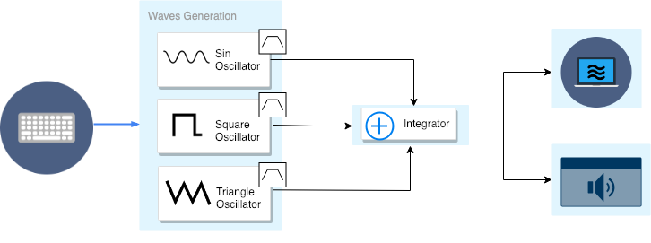

# Additive-Synthesier

This project is a real-time emulation of an additive synthesizer (the classical Mini Moog). In this system we relay on the \textbf{pthread} library for multi-threading programming. The system is responsible for the generation of the following wave-forms (sine, triangle and square) as described in the model below. Each with a specific frequency notes decided by users and then they are added/integrated together after they are passing through a dedicated Band Pass Filter (BPF).

## System Model

  

## Task Set

1. TASK Graphics: allocated for rendering the graphics.
2. TASK Keyboard: Actively poll the keyboard to trigger and control the frequency notes of each wave
3. TASK Wave-forms: each waveform has an independent periodic tasks.
4. TASK Audio handles the Integration of the wave-forms and passing the generated buffer through the audio card driver.
